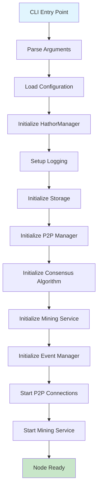
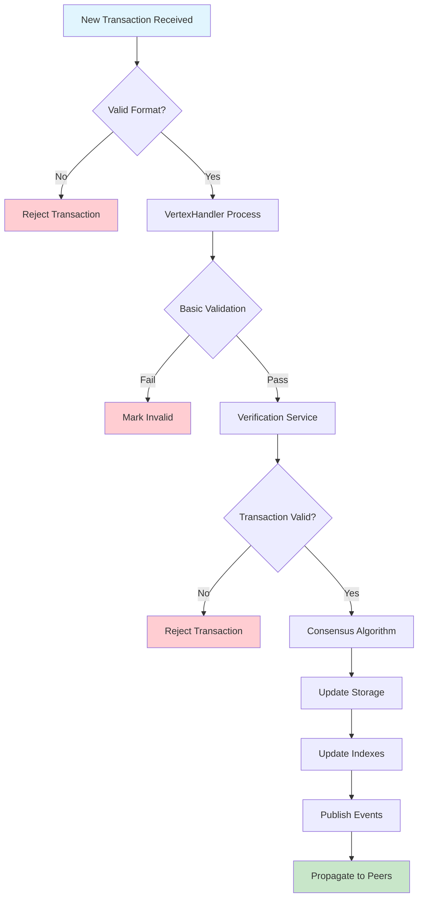
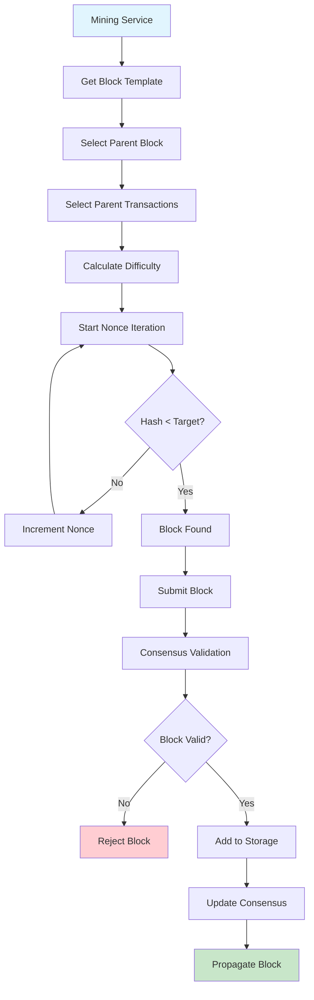
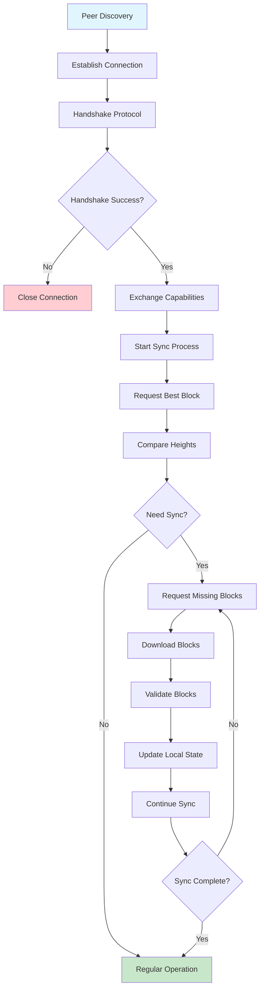
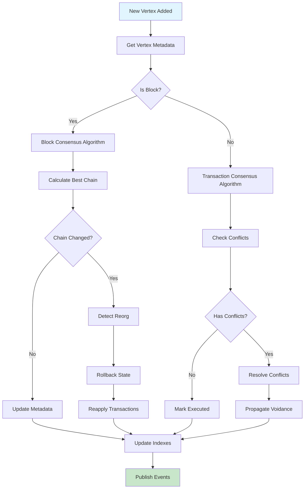
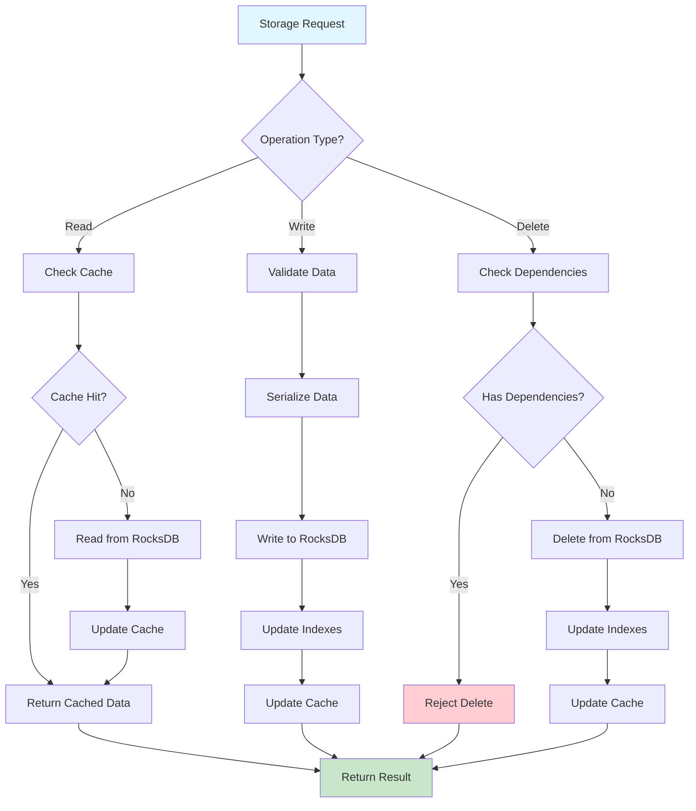
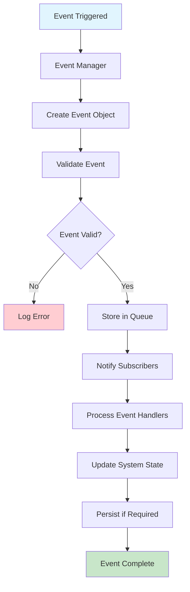
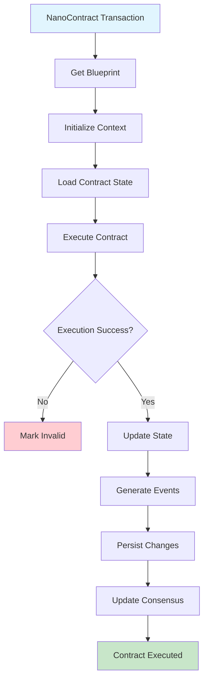
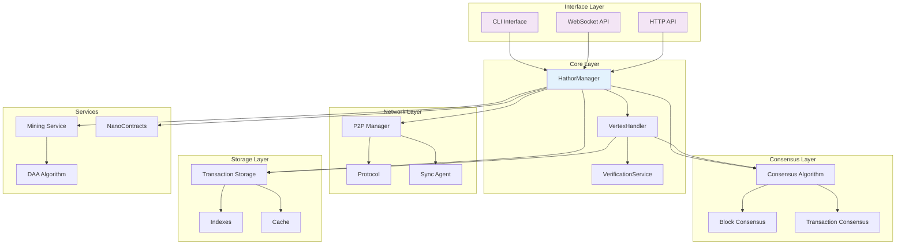
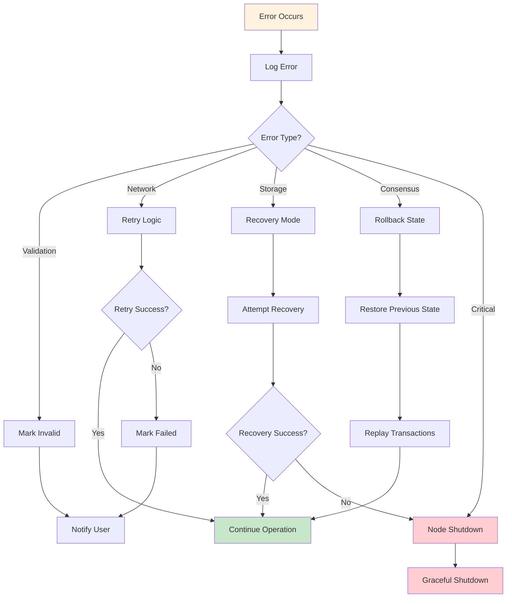

# Hathor Core System Flowcharts

This document contains visual flowcharts representing the key flows in the Hathor Core system.

## 1. Node Startup Flow

## 2. Transaction Processing Flow

## 3. Block Mining Flow

## 4. P2P Synchronization Flow

## 5. Consensus Update Flow

## 6. Storage Operations Flow

## 7. Event System Flow

## 8. NanoContract Execution Flow

## 9. Component Interaction Diagram

## 10. Error Handling Flow

These flowcharts provide a visual representation of the key processes and interactions within the Hathor Core system. They help understand the complexity and flow of operations in this sophisticated blockchain/DAG hybrid system. 
